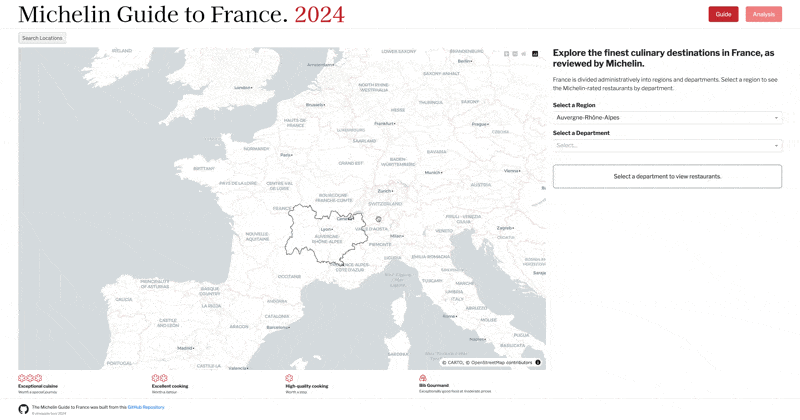
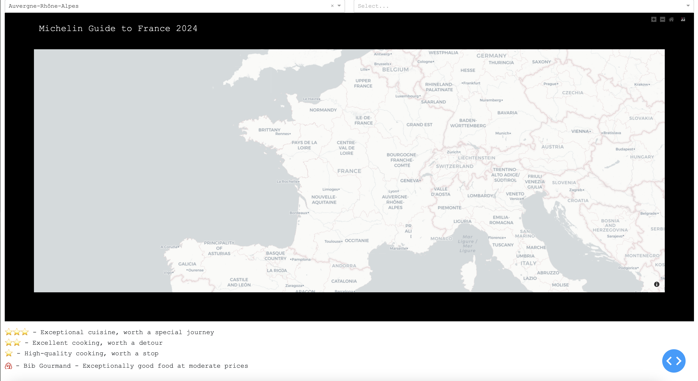

# Michelin Guide to France - Interactive Application


## Overview
The Michelin Guide to France application extends the [Michelin Rated Restaurants](https://github.com/pineapple-bois/Michelin_Rated_Restaurants) project as a dynamic user interface offering a variety of ways to explore Michelin-rated restaurants across France.

### Visit the live app here: [michelin-guide-france.net](https://michelin-guide-france.net)

This app came first place in [Plotly's Autumn App Challenge 2024](https://community.plotly.com/t/autumn-app-challenge/87373/26) 🥇

----

## Guide Page



### Overview
The Guide Page of the Michelin Guide to France allows users to explore Michelin-rated restaurants across various regions and departments of France, filtering restaurants based on their Michelin star ratings.

#### Key Features:
1. **Search by Location:**
   - Users can input location in France to find the corresponding Region and Department if that location exists in the Michelin Guide.
   - The entered location will be matched by the [LocationMatcher](utils/locationMatcher.py) class which disregards accents, punctuation and capitalisation.

2. **Michelin Rating Filter:**
   - Users can filter restaurants by Michelin rating (1, 2, 3 stars, and Bib Gourmand). When a department is selected, available star categories are shown, allowing users to refine the results displayed on the map.

3. **Detailed Restaurant Information:**
   - By clicking on a restaurant marker on the map, users can see detailed information about that restaurant, including its name, address, cuisine, and website.

----

## Analysis Page


### Overview
The Analysis Page provides users with insights into the distribution of Michelin-rated restaurants across France. Users can interact with the data, filter results, and observe trends related to distributions, regions, and star ratings.

#### Key Features:
1. **Restaurant distributions by `Region`, `Department` & `Arrondissement`:**
   - Users can select a granularity and filter restaurants based on their Michelin rating which dynamically adjusts the map and bar chart outputs.

2. **Socioeconomic section:**
   - Users can explore the distribution of starred restaurants along with various socioeconomic metrics obtained from [INSEE](https://www.insee.fr/fr/accueil)

3. **Wine regions:**
   - Users can explore the geographic distribution of France's main wine regions. 
   - Clicking a wine region connects to the [`OpenAI API`](https://openai.com/api/) and returns information on the main grape varieties, AOCs, Grand Crus, and food pairings.

----

## Technical Overview

This section outlines the architecture and key components behind the Michelin Guide to France application, built using [`Plotly Dash`](https://dash.plotly.com) and [`Flask`](https://flask.palletsprojects.com/en/3.0.x/). The app leverages dynamic filtering and real-time visualisations to provide users with an interactive experience.

### App Architecture

**Frontend Framework**: 
The app is developed using Dash, a Python framework for building analytical web applications. Dash handles the rendering of dynamic components such as dropdowns, maps, and charts, which are updated based on user input.
  - The app relies heavily on Dash callbacks for real-time interactivity. These callbacks are designed to handle multiple inputs, ensuring that only necessary updates are triggered to avoid performance bottlenecks.

**Backend Framework**: Flask serves as the web server for the application, managing HTTP requests and sessions.
  - Flask powers the integration with external services like the OpenAI API for wine region information and provides caching to optimise performance.
  - Dash operates as a set of routes within Flask. This modular integration separates concerns between the backend (Flask) and frontend (Dash), ensuring a scalable architecture.

**Data Processing**: The backend employs `Pandas` and `Geopandas` for efficient data manipulation. Restaurant data is filtered, aggregated, and displayed based on user selections (e.g., regions, star ratings).
  - GeoJSON data is used to map regions and restaurants, and this is rendered via Plotly.
  - Flask-Caching is leveraged to cache frequent queries, such as calls to external APIs (OpenAI).
  - In-memory caching ensures a smooth user experience during data-intensive interactions.

----

## User Experience

The application provides a highly interactive experience through the use of dynamic filters and an interactive map interface.

**Dynamic and Responsive Layout with CSS3:**
   - The app relies heavily on custom CSS3 for a dynamic and responsive layout ensuring a fluid user experience. The use of media queries and Flexbox layout enables the app to adjust the layout based on the viewport size, enhancing accessibility and usability.

**Interactive Filters with Click Data:**
   - Interactions with the app are managed through Dash callbacks that handle `clickData` events from Plotly charts. For example, when a user clicks on a restaurant marker on the map, details of the restaurant are dynamically fetched and displayed. This level of interactivity gives users real-time feedback based on their actions.

**User-Centric Zoom Persistence with `relayoutData`:**
   - To enhance user experience, the app preserves the zoom level and map center position when users explore tile maps. By storing the `relayoutData` from Plotly's map component, the app maintains the user's preferred zoom level and center point, ensuring a seamless experience when toggling between filters which inherently trigger a map reload.

**Customised Restaurant Filtering:**
   - The Michelin award filtering system allows users to select different levels of Michelin ratings which dynamically updates the map. This enables granular control over which restaurants are displayed, making it easier for users to explore their preferred dining options.
   - The filtering system is implemented using clickable buttons that change appearance based on their active/inactive state, providing clear visual cues to users.

**Data-Driven Visualisations and Insights:**
   - Visualisations are designed to be highly interactive, with choropleth maps and bar charts reflecting real-time user input. For example, changing the granularity from region to department instantly updates the map to show the new level of detail, enhancing the overall data exploration experience.

----


## Motivation

Whilst at university studying maths & physics I'm teaching myself to become a data engineer and this dataset contains a number of things that interest me; particularly, restaurants and geography! I was a chef in my previous career and worked for a number of Michelin rated chefs and well as spending time in France during my years behind the stove.

It has taken me some time to do this dataset justice and I feel I'm almost there. Developing this application involved translating working `matplotlib` functions to `plotly` whilst working to improve the design and UX.

#### Previous version (April 2024):



----

## Future Development

The development of this project will continue with the release of the 2025 Michelin Guide to France in March/April. Currently, my [data transformation process](https://github.com/pineapple-bois/Michelin_Rated_Restaurants) involves chaining multiple transformations and merges within a Jupyter notebook environment. I’ve logged significant changes between the 2023 and 2024 guidebooks, and I plan to expand the project further.

### Planned Enhancements:

**Automated ETL Process & PostgreSQL Integration:**

- I plan to define and automate an **Extract, Transform, Load (ETL)** process to populate a `PostgreSQL` database with time-series data. This will include handling geospatial data using [`PostGIS`](https://postgis.net).
- Given the stable administrative structure of France’s regions, the database will have static tables for regions, departments, and arrondissements optimized for **OLAP** operations.
- **SQLAlchemy** will be used to manage SQL queries, facilitating joins between tables while still leveraging `Geopandas` for geospatial data processing.
- Automating the extraction of data from **INSEE** will be a key challenge to address.
- These enhancements will support the development of a new feature page: `Michelin Changes`, tracking restaurant movements across editions.

**French Language Version:**
- The entire site will be translated into French to better cater to a local audience.
- Translations will be managed using **YAML** files to easily handle multilingual content.

**Comprehensive Wine Regions Database:**
- I plan to source and create a full set of wine regions, currently missing *Savoie*, *Sud-Ouest*, *Jura*, and *Corse*.
- Automating the labeling of individual **AOCs** (Appellations d'Origine Contrôlée) will also be part of this enhancement to improve wine region exploration.

----

## Local Setup Guide

Follow these instructions to run the Michelin Guide to France application locally on your machine.

### Step 1: Clone the Repository

Start by cloning the project from the GitHub repository:

```bash
git clone https://github.com/pineapple-bois/Michelin_Guide_France.git
cd Michelin_Guide_France
```

### Step 2: Create and Activate a Virtual Environment

Make sure you’re using Python 3.9 for this project.

```bash
# Create a virtual environment (use venv or virtualenv)
python3.9 -m venv venv

# Activate the virtual environment
# On macOS/Linux:
source venv/bin/activate

# On Windows:
venv\Scripts\activate
```

### Step 3: Install Required Dependencies

```bash
pip install -r requirements.txt
```

### Step 4: Set Up Environment Variables

Create a .env file in the root directory with the following:
```bash
OPENAI_API_KEY=<Your-OpenAI-API-Key>
FLASK_ENV=development
```

### Step 5: Modify the Application for Local Development

Before running the application locally, a few modifications are necessary to ensure it works in a local environment without SSL redirection and enables development features such as debugging.

1. **Disable HTTPS Redirection**:

In [`michelin_app.py`](michelin_app.py), lines 75-80 contain a function that enforces HTTPS by redirecting HTTP requests to HTTPS. This is necessary for production environments but can cause issues when running the app locally. You can comment out these lines to prevent HTTPS enforcement:

```python
# Comment out to launch locally (development)
@server.before_request
def before_request():
    if not request.is_secure:
        url = request.url.replace('http://', 'https://', 1)
        return redirect(url, code=301)
```

2.	**Enable Debugging Mode**:

By default, the app is set to run in a production mode where debugging features are disabled. For local development, you can enable debugging by modifying lines 1224-25 of [`michelin_app.py`](michelin_app.py):


```python
# For local development, set debug=True
if __name__ == '__main__':
    app.run_server(debug=True)  # Change from debug=False to debug=True
```
Setting `debug=True` enables useful features such as hot-reloading, which automatically restarts the server when changes are made to the code.

Once these changes are made, the app will run locally on http://127.0.0.1:8050 without enforcing HTTPS

---

## Contributions

Contributions are welcome! If you’d like to contribute or discuss potential features, feel free to reach out via a GitHub issue or by submitting a pull request. 

For major changes, please open an issue first to discuss what you would like to contribute.

Thank you for your interest in improving the Michelin Guide to France app!

----

[](LICENSE.md) [](https://pineapple-bois.github.io)

----
