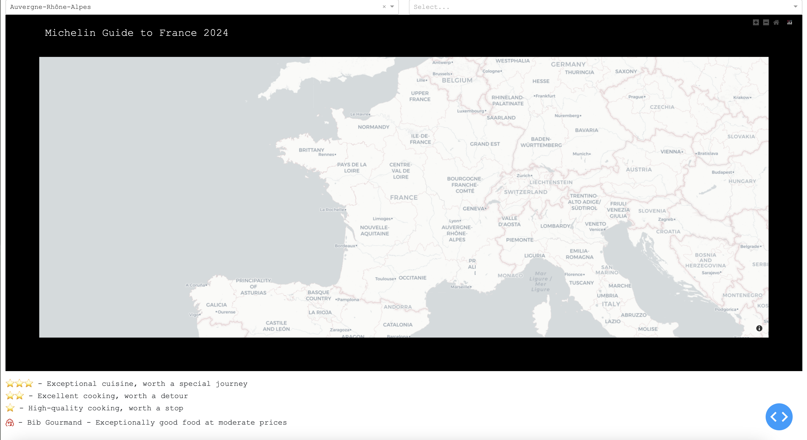

# Michelin Guide to France - Interactive Application

----

### Overview
This version of the Michelin Guide to France interactive application extends the [Michelin Rated Restaurants](https://github.com/pineapple-bois/Michelin_Rated_Restaurants) project as a dynamic user interface and offers way to explore Michelin-rated restaurants across France.

### Visit the live app here: [Michelin Guide to France](https://michelin-guide-france.net).

----

### Features
- Interactive map to explore different regions and departments of France.
- Detailed view of each Michelin rated restaurant including star ratings, cuisine type, pricing, and a link to the restaurant's website.
- Dynamic filtering based on Michelin ratings.

----

### What's New
- **Advanced Filtering Options**: Users can now filter restaurants based on star ratings within specific departments.
- **Enhanced User Interface**: Incorporation of a new stylesheet improves the aesthetic and functional aspects of the application.
- **Interactive Elements**: Enhanced map interactions including zoom features, dynamic updates, and detailed hover effects that provide information about each restaurant directly.
- **Modular Code Structure**: The previous version was refactored into more modular components for better maintainability and scalability of the application codebase.

#### Previous version:

----

### Technologies Used
- **Python**: Core programming language for server-side logic.
- **Pandas and GeoPandas**: Used for data analysis and handling geospatial data.
- **Plotly**: Employed for creating interactive data visualizations.
- **Dash by Plotly**: Framework used for building the web application with Python.
- **Dash Bootstrap Components**: Utilized for additional styling and responsive layout features.
- **Heroku**: Platform for hosting and deploying the application.

----

### Deployment
The application is configured for deployment on Heroku, with updates planned every April to align with new data from the Michelin Guide to France. 

The deployment setup includes:
- **Procfile**: Specifies the commands that are executed by the app on startup.
- **requirements.txt**: Lists all necessary Python libraries for the project, ensuring they are installed during the deployment process.

----
